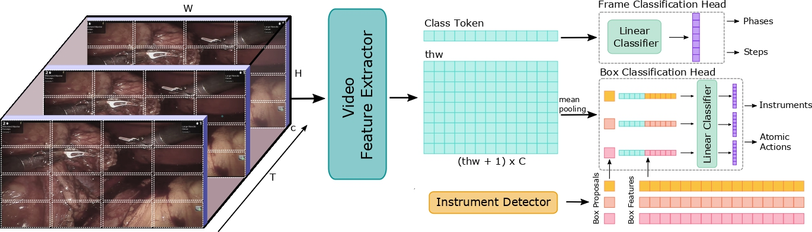

# Towards Holistic Surgical Scene Understanding

[Natalia Valderrama](https://nfvalderrama.github.io)<sup>1</sup>, [Paola Ruiz Puentes](https://paolaruizp.github.io)<sup>1*</sup>, Isabela Hernández<sup>1*</sup>, [Nicolás Ayobi](https://nayobi.github.io/)<sup>1</sup>, Mathilde Verlyck<sup>1</sup>, Jessica Santander<sup>2</sup>, Juan Caicedo<sup>2</sup>, Nicolás Fernández<sup>3,4</sup>, [Pablo Arbeláez](https://scholar.google.com.co/citations?user=k0nZO90AAAAJ&hl=en)<sup>1</sup> <br/>
<br/>
<sup>*</sup>Equal contribution.<br/>
<sup>1 </sup> Center  for  Research  and  Formation  in  Artificial  Intelligence .([CINFONIA](https://cinfonia.uniandes.edu.co/)),  Universidad  de  los  Andes,  Bogotá 111711, Colombia. <br/>
<sup>2 </sup> Fundación Santafé de Bogotá, Bogotá, Colombia<br/>
<sup>3 </sup> Seattle Children’s Hospital, Seattle, USA <br/>
<sup>4 </sup> University of Washington, Seattle, USA <br/>

- **Oral presentation and best paper nominee** at **Medical Image Computing and Computer Assisted Intervention (MICCAI) 2022**. Proceedings available at [springer](https://doi.org/10.1007/978-3-031-16449-1_42)**
- **Preprint** available at [arXiv](https://arxiv.org/abs/2212.04582).<br/>

Visit the project in our [website](https://biomedicalcomputervision.uniandes.edu.co/publications/towards-holistic-surgical-scene-understanding/) and our [youtube](https://youtu.be/G4ctkKgRkaY) channel.

<div align="center">
  
</div><br/>

We present a new experimental framework towards holistic surgical scene understanding. First, we introduce the Phase, Step, Instrument, and Atomic Visual Action recognition (PSI-AVA) Dataset. PSI-AVA includes annotations for both long-term (Phase and Step recognition) and short-term reasoning (Instrument detection and novel Atomic Action recognition) in robot-assisted radical prostatectomy videos. Second, we present Transformers for Action, Phase, Instrument, and steps Recognition (TAPIR) as a strong baseline for surgical scene understanding. TAPIR leverages our dataset’s multi-level annotations as it benefits from the learned representation on the instrument detection task to improve its classification capacity. Our experimental results in both PSI-AVA and other publicly available databases demonstrate the adequacy of our framework to spur future research on holistic surgical scene understanding.

This repository provides instructions to download the PSI-AVA dataset and run the PyTorch implementation of TAPIR, both presented in the paper Towards Holistic Surgical Scene Understanding, oral presentation at [MICCAI,2022](https://conferences.miccai.org/2022/en/). 

## GraSP dataset and TAPIS

Check out [**GraSP**](https://github.com/BCV-Uniandes/GraSP), an **extended version of our PSI-AVA dataset** that provides **surgical instrument segmentation** annotations and more data. Also check [**TAPIS**](https://github.com/BCV-Uniandes/GraSP/tree/main/TAPIS), the improved version of our method. GraSP and TAPIS have been published in this [arXiv](https://arxiv.org/abs/2401.11174).

## PSI-AVA

In this [link](http://157.253.243.19/PSI-AVA/), you will find the sampled frames of the original Radical Prostatectomy surgical videos and the annotations that compose the Phases, Steps, Instruments, and Atomic Visual Actions recognition dataset. You will also find the preprocessed data we used for training TAPIR, the instrument detector predictions, and the trained model weights on each task. The data in the link has the following organization.

```tree
PSI-AVA:
|
|_TAPIR_trained_models
|      |_ACTIONS
|      |    |_Fold1
|      |    |   |_checkpoint_best_actions.pyth
|      |    |_Fold2
|      |        |_checkpoint_best_actions.pyth
|      |_INSTRUMENTS
|      |    ...
|      |_PHASES
|      |    ...
|      |_STEPS
|           ...
|
|_def_DETR_box_ftrs
|     |_fold1
|     |   |_train
|     |   |   |_box_features.pth
|     |   |_val
|     |       |_box_features.pth
|     |_fold2
|         ...
|
|_images_8_frames_per_second
|       |_keyframes
|       |     |_CASE001
|       |     |    |_000000.jpg
|       |     |    |_000006.jpg
|       |     |    |_0000011.jpg
|       |     |    ...
|       |     |_CASE002
|       |     |    ...
|       |     ...
|       |_RobotSegSantaFe_v3_dense.json 
|       |_RobotSegSantaFe_v3_dense_fold1.json
|       |_RobotSegSantaFe_v3_dense_fold2.json 
|
|_keyframes
        |_CASE001
        |     |_00000.jpg
        |     |_00001.jpg
        |     |_00002.jpg
        |     ...
        |_CASE002
        |     ...
          ...
```

We recommend downloading the data recursively with the following command:

```sh
$ wget -r http://157.253.243.19/PSI-AVA
```

You will find PSIAVA's data partition and annotations in the [outputs/data_annotations.](https://github.com/BCV-Uniandes/TAPIR/tree/main/outputs/data_annotations) directory.

## TAPIR

<div align="center">
  
</div><br/>

### Installation
Please follow these steps to run TAPIR:

```sh
$ conda create --name tapir python=3.8 -y
$ conda activate tapir
$ conda install pytorch==1.9.0 torchvision==0.10.0 cudatoolkit=11.1 -c pytorch -c nvidia

$ conda install av -c conda-forge
$ pip install -U iopath
$ pip install -U opencv-python
$ pip install -U 'git+https://github.com/cocodataset/cocoapi.git#subdirectory=PythonAPI'
$ pip install 'git+https://github.com/facebookresearch/fvcore'
$ pip install 'git+https://github.com/facebookresearch/fairscale'
$ python -m pip install 'git+https://github.com/facebookresearch/detectron2.git'

$ git clone https://github.com/BCV-Uniandes/TAPIR
$ cd TAPIR
$ pip install -r requirements.txt
```

Our code builds upon [Multi Scale Vision Transformers](https://github.com/facebookresearch/SlowFast)[1]. For more information, please refer to this work.

### Preparing data

Download the "keyframes" folder in [PSI-AVA](http://157.253.243.19/PSI-AVA/) in the repository's folder ./outputs/PSIAVA/

 ```PSI-AVA/keyframes/* ===> ./outputs/PSIAVA/keyframes/```

Download the instrument features computed by deformable DETR from the folder "Def_DETR_Box_ftrs" in [PSI-AVA](http://157.253.243.19/PSI-AVA/) as follows:
 
 ```PSI-AVA/def_DETR_box_ftrs/fold1/* ===> ./outputs/data_annotations/psi-ava/fold1/*```

 ```PSI-AVA/def_DETR_box_ftrs/fold2/* ===> ./outputs/data_annotations/psi-ava/fold2/*```
 
 In the end, the ```outputs``` directory must have the following structure.
 
  ```tree
  outputs
  |_data_annotations
  |      |_psi-ava
  |      |     |_fold1
  |      |     |    |_annotationas
  |      |     |    |    ...
  |      |     |    |_coco_anns
  |      |     |    |    ...
  |      |     |    |_frame_lists
  |      |     |    |    ...
  |      |     |    |_train
  |      |     |    |    |_box_features.pth
  |      |     |    |_val
  |      |     |         |_box_features.pth
  |      |     |_fold2
  |      |          ...
  |      |_psi-ava_extended
  |            ...
  |_PSIAVA
         |_keyframes 
                 |_CASE001
                 |      |_00000.jpg
                 |      |_00001.jpg
                 |      ...
                 |_CASE002
                        ...
                 ...
  ```

### Running the code

First, add this repository for $PYTHONPATH

```sh
$ export PYTHONPATH=/path/to/TAPIR/slowfast:$PYTHONPATH
```

For training TAPIR in:

```sh
# the Instrument detection or Atomic Action recognition task
$ bash run_examples/mvit_short_term.sh

# the Phases or Steps recognition task
$ bash run_examples/mvit_long_term.sh
```

### Evaluating models

| Task | mAP | config | run file | model |
| ----- | ----- | ----- | ----- | ----- |
| Phases | 56.55 $\pm$ 2.31 | [PHASES](configs/MVIT_PHASES.yaml) | [long_term](run_examples/mvit_long_term.sh) | [phases](http://157.253.243.19/PSI-AVA/TAPIR_trained_models/PHASES/) |
| Steps | 45.56 $\pm$ 0.004 | [STEPS](configs/MVIT_STEPS.yaml) | [long_term](run_examples/mvit_long_term.sh) | [steps](http://157.253.243.19/PSI-AVA/TAPIR_trained_models/STEPS/) |
| Instruments | 80.85 $\pm$ 1.54 | [TOOLS](configs/MVIT_TOOLS.yaml) | [short_term](run_examples/mvit_short_term.sh) | [tools](http://157.253.243.19/PSI-AVA/TAPIR_trained_models/INSTRUMENTS/) |
| Actions | 28.68 $\pm$ 1.33 | [ACTIONS](configs/MVIT_ACTIONS.yaml) | [short_term](run_examples/mvit_short_term.sh) | [actions](http://157.253.243.19/PSI-AVA/TAPIR_trained_models/ACTIONS/) |

Download our trained models in [PSI-AVA](http://157.253.243.19/PSI-AVA/)/TAPIR_trained_models.

Add this path in the run_examples/mvit_*.sh file corresponding to the task you want to evaluate. Enable test by setting in the config **TEST.ENABLE True**

## Citing TAPIR

If you use PSI-AVA or TAPIR (or their extended versions, GraSP and TAPIS) in your research, please include the following BibTex citations in your papers.
```BibTeX
@misc{ayobi2024pixelwise,
      title={Pixel-Wise Recognition for Holistic Surgical Scene Understanding}, 
      author={Nicol{\'a}s Ayobi and Santiago Rodr{\'i}guez and Alejandra P{\'e}rez and Isabela Hern{\'a}ndez and Nicol{\'a}s Aparicio and Eug{\'e}nie Dessevres and Sebasti{\'a}n Peña and Jessica Santander and Juan Ignacio Caicedo and Nicol{\'a}s Fern{\'a}ndez and Pablo Arbel{\'a}ez},
      year={2024},
      eprint={2401.11174},
      archivePrefix={arXiv},
      primaryClass={cs.CV}
}

@@InProceedings{valderrama2020tapir,
      author={Natalia Valderrama and Paola Ruiz and Isabela Hern{\'a}ndez and Nicol{\'a}s Ayobi and Mathilde Verlyck and Jessica Santander and Juan Caicedo and Nicol{\'a}s Fern{\'a}ndez and Pablo Arbel{\'a}ez},
      title={Towards Holistic Surgical Scene Understanding},
      booktitle={Medical Image Computing and Computer Assisted Intervention -- MICCAI 2022},
      year={2022},
      publisher={Springer Nature Switzerland},
      address={Cham},
      pages={442--452},
      isbn={978-3-031-16449-1}
}
```

## References

[1] H. Fan, Y. Li, B. Xiong, W.-Y. Lo, C. Feichtenhofer, ‘PySlowFast’, 2020. https://github.com/facebookresearch/slowfast.