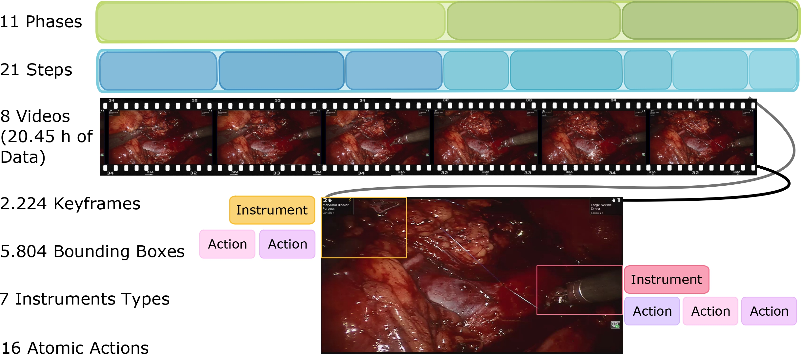

# Towards Holistic Surgical Scene Understanding

We present a new experimental framework towards holistic surgical scene  understanding. First, we introduce the Phase, Step, Instrument, and Atomic Visual Action recognition (PSI-AVA) Dataset. PSI-AVA includes annotations for both long-term (Phase and Step recognition) and short-term reasoning (Instrument detection and novel Atomic Action recognition) in robot-assisted radical prostatectomy videos. Second, we present Transformers for Action, Phase, Instrument, and steps Recognition (TAPIR) as a strong baseline for surgical scene understanding. TAPIR leverages our dataset’s multi-level annotations as it benefits from the learned representation on the instrument detection task to improve its classification capacity. Our experimental results in both PSI-AVA and other publicly available databases demonstrate the adequacy of our framework to spur future research on holistic surgical scene understanding

This repository provides instructions to download the PSI-AVA dataset and run the PyTorch implementation of TAPIR, both presented in the paper Towards Holistic Surgical Scene Understanding. Oral presentation at [MICCAI,2022](https://conferences.miccai.org/2022/en/). 

## Paper

[Towards Holistic Surgical Scene Understanding](https://arxiv.org/abs/2212.04582) <br/>
[Natalia Valderrama](https://nfvalderrama.github.io)<sup>1</sup>, [Paola Ruiz Puentes](https://paolaruizp.github.io)<sup>1*</sup>, Isabela Hernández<sup>1*</sup>, [Nicolás Ayobi](https://nayobi.github.io/)<sup>1</sup>, Mathilde Verlyck<sup>1</sup>, Jessica Santander<sup>2</sup>, Juan Caicedo<sup>2</sup>, Nicolás Fernández<sup>3,4</sup>, [Pablo Arbeláez](https://scholar.google.com.co/citations?user=k0nZO90AAAAJ&hl=en)<sup>1</sup> <br/>
<sup>*</sup>Equal contribution.<br/>
<sup>1 </sup> Center  for  Research  and  Formation  in  Artificial  Intelligence .([CINFONIA](https://cinfonia.uniandes.edu.co/)),  Universidad  de  los  Andes,  Bogotá 111711, Colombia. <br/>
<sup>2 </sup> Fundación Santafé de Bogotá, Bogotá, Colombia<br/>
<sup>3 </sup> Seattle Children’s Hospital, Seattle, USA <br/>
<sup>4 </sup> University of Washington, Seattle, USA <br/>

**Preprint available at [ArXiv](https://arxiv.org/abs/2212.04582) "Towards Holistic Surgical Scene Understanding" with code 2212.04582**<br/>
**Proceedings available at [springer](https://doi.org/10.1007/978-3-031-16449-1_42) "Towards Holistic Surgical Scene Understanding", Volume 13437 of the Lecture Notes in Computer Science series.**

Visit the project in our [website](https://biomedicalcomputervision.uniandes.edu.co/publications/towards-holistic-surgical-scene-understanding/) and in our [youtube](https://youtu.be/G4ctkKgRkaY) channel.

## PSI-AVA

<div align="center">
  
</div><br/>

In this [link](http://157.253.243.19/PSI-AVA/) you will find the original Radical Prostatectomy surgical videos and annotations that compose the Phases, Steps, Instruments and Atomic Visual Actions recognition dataset. You will also find the preprocessed data we used for training TAPIR, the instrument detector predictions and the trained model weights on each task. The data in the link has the following organization

```tree
PSI-AVA:
|
|--TAPIR_trained_models
|        |---ACTIONS
|        |      |---Fold1
|        |      |     |---checkpoint_best_actions.pyth
|        |      |---Fold2
|        |            |---checkpoint_best_actions.pyth
|        |---INSTRUMENTS
|               ...
|        |---PHASES
|               ...
|        |---STEPS
|               ...
|
|--def_DETR_box_ftrs
|        |---fold1
|              |--train
|              |      |--box_features.pth
|              |--val
|              |      |--box_features.pth
|        |---fold2
|              ...
|
|--images_8_frames_per_second
|         |---keyframes
|         |        |---CASE001
|         |        |       |---000000.jpg
|         |        |       |---000006.jpg
|         |        |       |---0000011.jpg
|         |        |       ...
|         |        |---CASE002
|         |        ...
|         |---RobotSegSantaFe_v3_dense.json 
|         |---RobotSegSantaFe_v3_dense_fold1.json
|         |---RobotSegSantaFe_v3_dense_fold2.json 
|
|--keyframes
          |---CASE001
          |        |--00000.jpg
          |        |--00001.jpg
          |        |--00002.jpg
          |        ...
          |---CASE002
```

You will find the PSIAVA's benchmark data partition and annotations in outputs/data_annotations.

## TAPIR


### Installation
Please follow these steps to run TAPIR:

```sh
conda create --name tapir python=3.8 -y
conda activate tapir
conda install pytorch==1.9.0 torchvision==0.10.0 cudatoolkit=11.1 -c pytorch -c nvidia

pip install -U opencv-python
pip install 'git+https://github.com/facebookresearch/fvcore'
python -m pip install 'git+https://github.com/facebookresearch/detectron2.git'

git clone https://github.com/BCV-Uniandes/TAPIR
cd TAPIR
pip install -r requirements.txt
```

Our code builds upon [Multi Scale Vision Transformers](https://github.com/facebookresearch/SlowFast)[1]. For more information, please refer to this work.

### Training

Download the "keyframes" folder in [PSI-AVA](http://157.253.243.19/PSI-AVA/) in the repository's folder ./outputs/PSIAVA/

 ```PSI-AVA/keyframes/* ===> ./outputs/PSIAVA/keyframes/```

Download the instrument features computed by deformable DETR from the folder "Def_DETR_Box_ftrs" in [PSI-AVA](http://157.253.243.19/PSI-AVA/) as follows:
 
 ```PSI-AVA/def_DETR_box_ftrs/fold1/* ===> ./outputs/data_annotations/psi-ava/fold1/*```

 ```PSI-AVA/def_DETR_box_ftrs/fold2/* ===> ./outputs/data_annotations/psi-ava/fold2/*```
 
 In the end, the ```outputs``` directory must have the following structure
  ```tree
  outputs
  |---data_annotations
  |         |---psi-ava
  |         |        |---fold1
  |         |        |       |---annotationas
  |         |        |                ...
  |         |        |       |---coco_anns
  |         |        |                ...
  |         |        |       |--frame_lists
  |         |        |                ...
  |         |        |       |---train
  |         |        |             |--box_features.pth
  |         |        |       |---val
  |         |        |             |--box_features.pth
  |         |        |---fold2
  |         |                ...
  |         |---psi-ava_extended
  |                  ...
  |---PSIAVA
            |---keyframes 
                       |---CASE001
                       |         |---00000.jpg
                       |         |---00001.jpg
                       |         ...
                       |---CASE002
                                 ...
                       ...
  ```

For training TAPIR in:

```
# the Instrument detection or Atomic Action recognition task
$ bash run_examples/mvit_short_term.sh

# the Phases or Steps recognition task
$ bash run_examples/mvit_long_term.sh
```

Evaluating the models:

Download our trained models in [PSI-AVA](http://157.253.243.19/PSI-AVA/)/TAPIR_trained_models.

Add this path in the run_examples/mvit_*.sh file corresponding to the task you want to evaluate. Enable test by setting in the config **TEST.ENABLE True**

#### Citing TAPIR
If you use PSI-AVA or TAPIR in your research please include the following BibTex citation in your papers.
```BibTeX
@misc{valderrama2020tapir,
  author =       {Natalia Valderrama and Paola Ruiz Puentes and Isabela Hern{\'a}ndez and Nicol{\'a}s Ayobi Mathilde Verlyk and Jessica Santander and Juan Caicedo and Nicol{\'a}s Fern{\'a}ndez and Pablo Arbel{\'a}es},
  title =        {Towards Holistic Surgical Scene Understanding},
  howpublished = {\url{https://github.com/BCV-Uniandes/TAPIR}},
  journal=       {MICCAI},
  year =         {2022}
}
```

## References

[1] H. Fan, Y. Li, B. Xiong, W.-Y. Lo, C. Feichtenhofer, ‘PySlowFast’, 2020. https://github.com/facebookresearch/slowfast.
